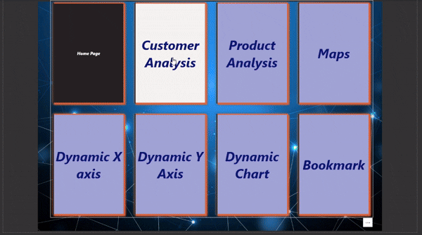
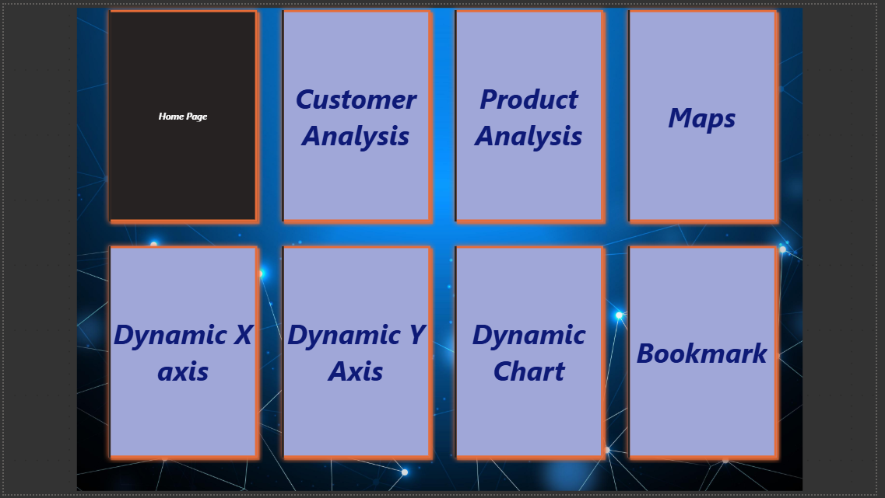
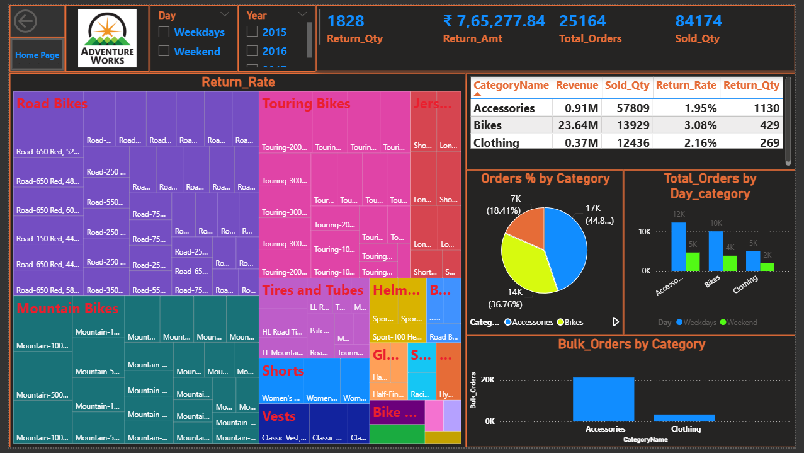
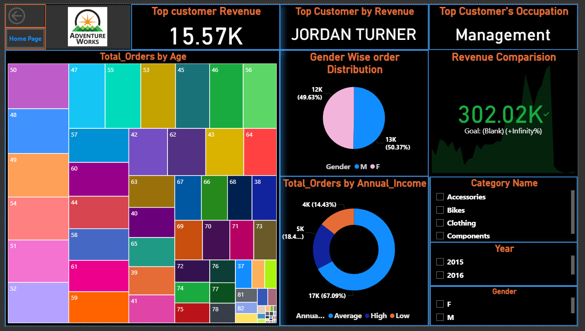
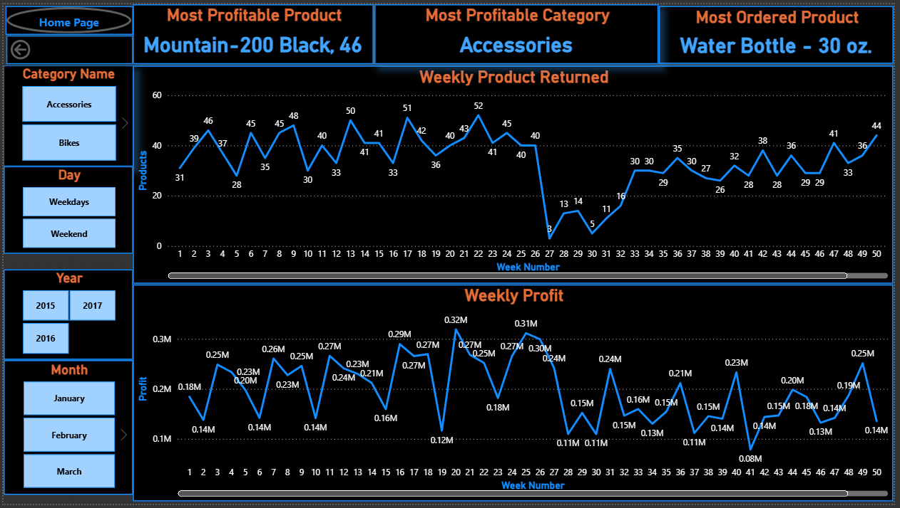
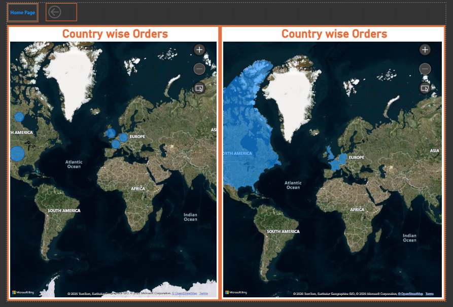
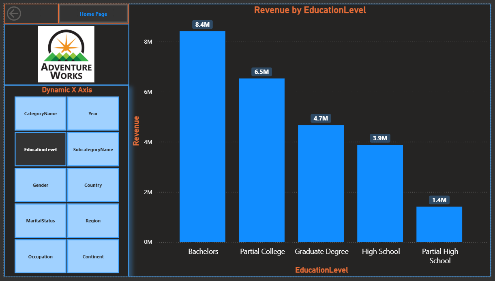
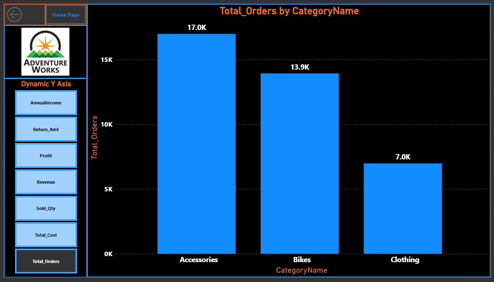
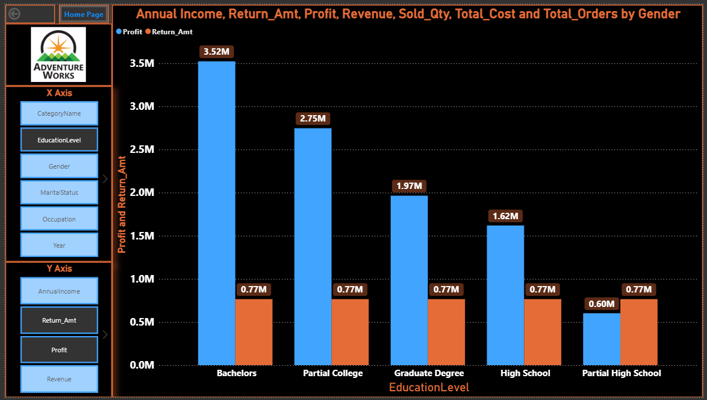
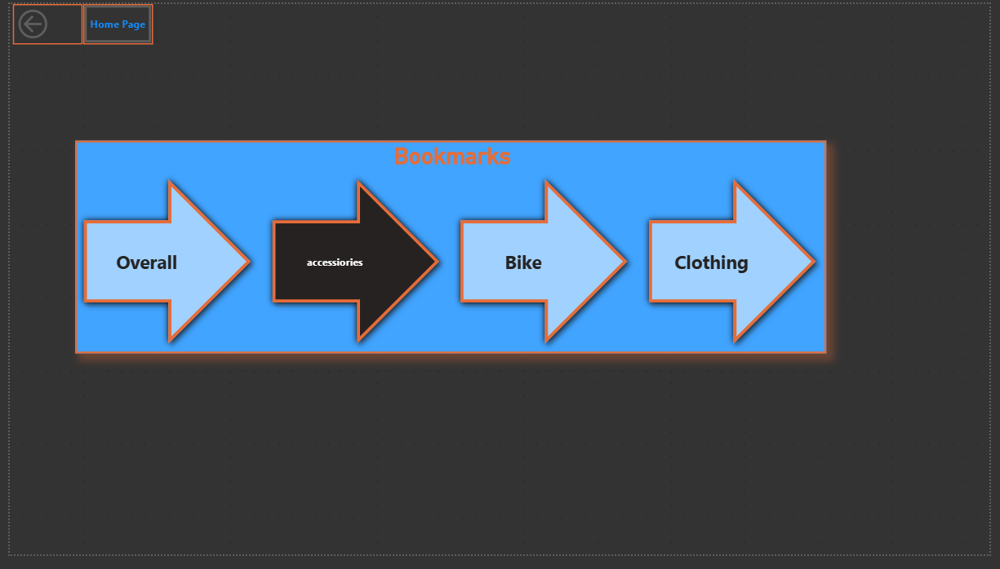

# 📊 Power BI – Adventure Works Sales Analysis Dashboards   

## 📌 Overview  
This project presents **9 interactive Power BI dashboards** showcasing advanced business intelligence concepts.  
It demonstrates skills in **data modeling, DAX, bookmarks, dynamic visuals, maps, and interactive analysis**.  

---

**Quick Preview :**  
  

# Adventure Works Dashboard (Power BI)

---
## 📊 Dashboards  

### 🔹 1. Home Page  
  

### 🔹 2. Category Analysis  
  

### 🔹 3. Customer Analysis  
  

### 🔹 4. Product Analysis  
  

### 🔹 5. Maps (Country-wise Orders)  
  

### 🔹 6. Dynamic X-Axis  
  

### 🔹 7. Dynamic Y-Axis  
  

### 🔹 8. Dynamic Chart  
  

### 🔹 9. Bookmarks Navigation  
  

---

## ⚙️ Features  
✔️ KPIs (Sales, Orders, Return Rate)  
✔️ Category, Customer & Product-wise insights  
✔️ Drill-through using **Bookmarks**  
✔️ Interactive slicers (Year, Day Category, etc.)  
✔️ Dynamic X & Y axis charts  
✔️ Country-wise sales using Maps  

---

